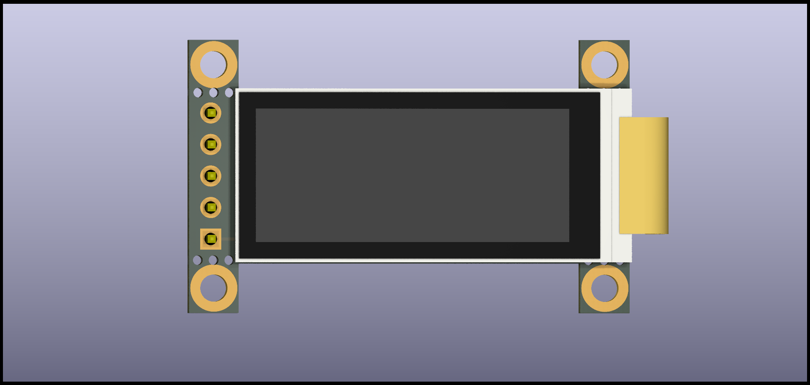
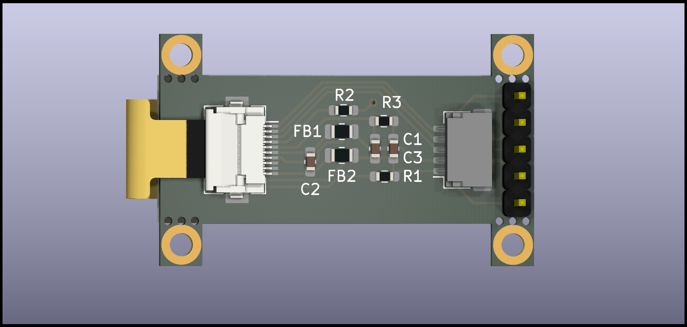
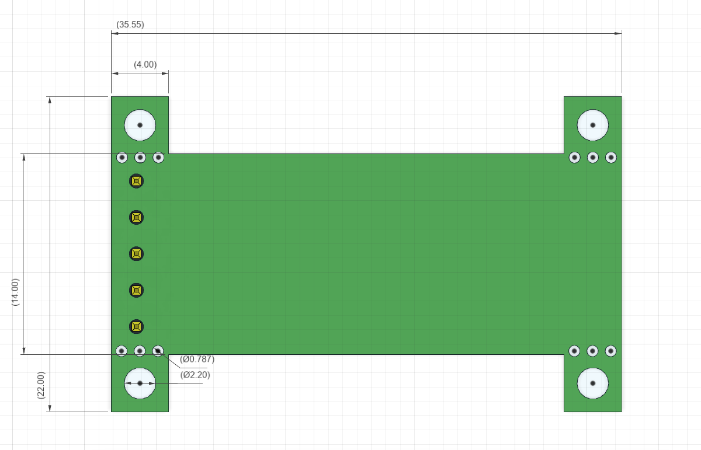

# Sharp Memory Display Breakout - nice!view Compatible Version (LS011B7DH03)

A pin-compatible breakout board for the Sharp LS011B7DH03, designed as a DIY alternative to the [nice!view](https://nicekeyboards.com/nice-view). This 1.1-inch, 160x68 pixel monochrome memory display features e-paper-like characteristics (~10µA power draw) and high refresh rate (30Hz).

## Sponsor

**This project is proudly sponsored by [NextPCB](https://www.nextpcb.com)** - Your trusted PCB Prototype & Fabrication Manufacturer. NextPCB provides high-quality PCB manufacturing services with fast turnaround times, making them the perfect partner for bringing electronics projects to life.

## About This Version

This is the **nice!view compatible version without mounting holes**. It features the same pinout as the nice!view but has a smaller footprint by omitting the mounting holes. This version is ideal for space-constrained builds where mounting holes aren't needed.

**Note:** This is a DIY project. For a ready-to-use product, consider purchasing the [nice!view](https://nicekeyboards.com/nice-view) instead.

## Other Versions

This repository contains multiple versions of the breakout board:

- **[Main Branch](https://github.com/karnadii/sharp_memory_display_breakout/tree/main)**: Original version with 128x32 OLED pinout compatibility
- **[niceview-compat](https://github.com/karnadii/sharp_memory_display_breakout/tree/niceview-compat)**: Pin-compatible with mounting holes for secure installation

Production files (Gerber, schematic, STEP) for all versions are available in the [Releases section](https://github.com/karnadii/sharp_memory_display_breakout/releases).

## Pinout Compatibility

This version is pin-compatible with the nice!view and should work with the same ZMK configurations. The pinout matches the nice!view standard for easy drop-in replacement.

## Installation

The breakout can be used in several ways:
- **Socketed/Soldered:** Solder pin headers to use it directly with a microcontroller board.
- **Daughterboard:** Solder the JST connector and use it as a daughterboard.

## PCB Size

## Bill of Materials (BOM)

| Ref | Qty | Value | Footprint | LCSC Part # | Notes |
|:--- |:---:|:------|:----------|:------------|:------|
| C1 | 1 | 560pF or 680pF | 0603 | C84721 | Unpolarized Capacitor |
| C2,C3 | 2 | 1uF | 0603 | C15849 | Unpolarized Capacitor |
| FB1,FB2 | 2 | Ferrite Bead | 0805 | C1017 | |
| J2 | 1 | FH12-10S-0.5SH | - | C506791 | FPC Connector |
| J3 | 1 | JST SH 5x1 | - | [AliExpress](https://www.aliexpress.com/item/1005003131441676.html) | Optional |
| R1,R2,R3 | 3 | 10kΩ | 0603 | C25804 | Optional |
| Display | 1 | LS011B7DH03 | - | [AliExpress](https://aliexpress.com/item/1005001809102193.html) | |

**Notes:**
- The resistors (R1, R2, R3) are optional and may not be required for the display to function.
- The LS011B7DH03 display can be difficult to source. The link provided is one of the few known sellers on AliExpress. Quality may vary.

## Cost Estimate

This is a DIY project. The approximate cost for a single breakout board is **$15 - $20** (before shipping), assuming you order 5 PCBs from a service like [NextPCB](https://www.nextpcb.com) and source the displays from AliExpress. Costs can be reduced by sourcing components from cheaper vendors and self-assembly.

For comparison, the pre-built [nice!view](https://nicekeyboards.com/nice-view) is sold for around $20.

## Demos

The breakout has been tested with CircuitPython, Arduino, and ZMK (on an nrfmicro). Example code can be found in the `test_code` folder.

### Arduino
https://user-images.githubusercontent.com/18657277/137644641-276d998f-445c-41ad-aaf1-b85f445b7fb1.mp4

### CircuitPython
https://user-images.githubusercontent.com/18657277/146429499-8556456f-ffeb-47a3-a99c-73e11da73714.mp4

### ZMK
